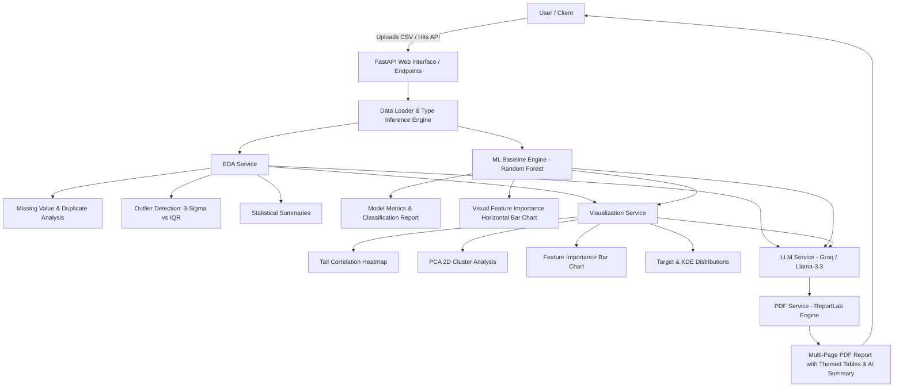

# ⚡ Automated CSV to EDA & Machine Learning Report Generator

[](https://fastapi.tiangolo.com)
[](https://www.python.org/)
[](https://scikit-learn.org/)
[](https://www.reportlab.com/)
[](https://groq.com/)
[](https://opensource.org/licenses/MIT)

> An enterprise-grade, end-to-end Automated Exploratory Data Analysis (AutoEDA) and Baseline Machine Learning pipeline that ingests any structured CSV dataset, executes statistical modeling, and compiles a publication-quality multi-page PDF report with AI-powered executive insights.

---

## 🌟 Key Features

- **📊 Comprehensive AutoEDA Engine:**
  - Automated column type inferencing (Numeric, Categorical, ID-like) and task detection (Classification vs Regression).
  - 5-number descriptive statistics, missing value ratios, and duplicate distribution distributions.
  - Dual outlier detection comparing **3-Sigma Rule** against **Interquartile Range ($1.5 \times \text{IQR}$)**.

- **🎯 Machine Learning Baseline:**
  - Automatic preprocessing, median imputation, label encoding, and stratified train/test partitioning.
  - Baseline `RandomForestClassifier` with balanced class weights.
  - Full evaluation metrics: Accuracy, Precision, Recall, F1-Score, ROC-AUC, and detailed Scikit-Learn classification reports.

- **📈 Advanced Visual Analytics:**
  - **PCA 2D Cluster Analysis:** Standardized 2-component dimensionality reduction with explained variance percentages ($PC_1, PC_2$) and class separation coloring.
  - **Visual Feature Importance:** Horizontal bar chart with color gradient and exact numerical decision weights.
  - **High-Resolution Correlation Heatmap:** Scaled height with annotated coefficients and clean axis labeling.
  - **Distribution Plots:** Target class balance charts and Kernel Density Estimation (KDE) curves.

- **🤖 Full-Page AI Executive Summary:**
  - Generates an executive verdict, data quality assessment, feature driver explanations, PCA interpretations, and strategic deployment roadmaps using **Groq API (`llama-3.3-70b-versatile`)** or **OpenAI**.
  - Includes a built-in rule-based analytical fallback for reliable offline report compilation.

- **📄 Publication-Quality PDF Engine:**
  - Built with ReportLab using tailored color palettes for each table (Indigo, Sky Blue, Teal, Violet, Crimson, Royal Blue).
  - Prominent timestamp tracking (`📅 Generated on: Date • Time`).

- **💻 Modern Web Dashboard & REST API:**
  - Dark-themed glassmorphism interface with drag-and-drop CSV upload and real-time metric display.
  - OpenAPI Swagger documentation at `/docs`.

---

## 🏗️ Architecture & Pipeline Flow



---

## 📂 Project Structure

```
fastapi/
│
├── .env.example                # Environment configuration template
├── Cancer_Data.csv             # Bundled sample medical dataset
├── requirements.txt            # Python dependencies
├── pyproject.toml              # Build & project metadata
├── README.md                   # Project documentation
│
└── app/
    ├── main.py                 # FastAPI application entrypoint
    ├── core/
    │   └── config.py           # Configuration settings and auto .env loader
    ├── routers/
    │   ├── web.py              # Interactive dark-themed web dashboard
    │   ├── report.py           # Report generation endpoints
    │   └── health.py           # Health check endpoint
    ├── services/
    │   ├── data_loader.py      # CSV parser and column type detector
    │   ├── eda_service.py      # Statistical summaries, outliers, and duplicates
    │   ├── model_service.py    # Random Forest training and evaluation
    │   ├── visualization_service.py # PCA, Heatmap, and Feature Importance charting
    │   ├── llm_service.py      # Groq / OpenAI executive summary generator
    │   ├── pdf_service.py      # ReportLab PDF compilation and formatting
    │   └── report_service.py   # Main orchestrator pipeline
    └── utils/
        └── file_utils.py       # Storage & file management utilities
```

---

## 🚀 Quick Start Guide

### 1. Clone the Repository
```bash
git clone https://github.com/soumyadeep531/csv-to-report-generator.git
cd csv-to-report-generator
```

### 2. Create and Activate Virtual Environment
```bash
# Windows (PowerShell)
python -m venv .venv
.venv\Scripts\Activate.ps1

# Linux / macOS
python3 -m venv .venv
source .venv/bin/activate
```

### 3. Install Dependencies
```bash
pip install -r requirements.txt
```

### 4. Configure Environment Variables (Optional for Live LLM)
Create a `.env` file from `.env.example`:
```bash
# Windows PowerShell
Copy-Item .env.example .env

# Linux / macOS
cp .env.example .env
```
Add your Groq API key in `.env`:
```env
GROQ_API_KEY=gsk_your_actual_groq_key_here
```
*(If no API key is provided, the application automatically uses the built-in intelligent rule-based summary engine).*

### 5. Launch the Server
```bash
python -m app.main
```

- 🌐 **Web Interface:** [http://127.0.0.1:8000](http://127.0.0.1:8000)
- 📚 **Swagger API Docs:** [http://127.0.0.1:8000/docs](http://127.0.0.1:8000/docs)
- 📖 **ReDoc:** [http://127.0.0.1:8000/redoc](http://127.0.0.1:8000/redoc)

---

## 📡 API Endpoints

| Method | Endpoint | Description |
| :--- | :--- | :--- |
| `POST` | `/api/generate-report` | Upload a CSV file with optional target/drop column parameters to generate PDF |
| `GET` | `/api/sample-report` | Run complete pipeline on bundled `Cancer_Data.csv` |
| `GET` | `/api/reports/{filename}` | Download a generated PDF report |
| `GET` | `/health` | Server status and uptime monitoring |
| `GET` | `/` | Web user dashboard |

---

## 📄 License
This project is open-source and licensed under the [MIT License](LICENSE).
